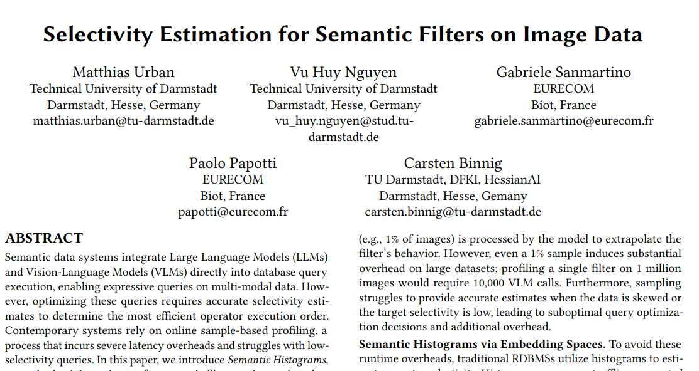
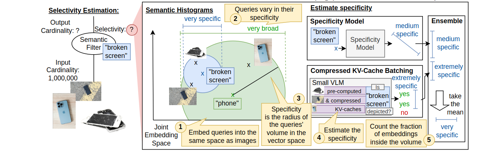

# Selectivity Estimation for Semantic Filters on Image Data

This repository contains the implementation explained in "Selectivity Estimation for Semantic Filters on Image Data" by Matthias Urban, Vu Huy Nguyen, Gabriele Sanmartino, Paolo Papotti and Carsten Binnig. [[pdf]](https://arxiv.org/pdf/2606.04610v1)




## Instructions

```
# Installation
pip install -e .

# Download artifacts, they contain the trained specificity model
# https://drive.google.com/file/d/1K9HtrRovywFrJTMFWz6AoCW6DLFRtPhh/view?usp=sharing
# Unzip the artifacts
tar -xzf artifacts.tar.gz

# Run experiments and plot results
python scripts/benchmark_run.py wildlife --num-queries 100 --num-filters 2 3 4 --num-kv-caches 32 64 128 --num-embeddings 1000 --sample-sizes 1 2 4 8 16 32 64
python scripts/benchmark_plot.py artwork wildlife ecommerce --num-queries 100
```

### Train specificity model

```
# download and extract imagenet: https://www.kaggle.com/datasets/thbdh5765/ilsvrc2012

# Prepare
python scripts/wikidata_embed.py <path/to/imagenet>/ILSVRC/Data/CLS-LOC/train --sample 500_000 --batch-size 100 --recursive

# Train model
python scripts/threshold_train.py wordnet
```

## Citation

If you use this code, please cite our paper:

```
@misc{urban2026selectivityestimationsemanticfilters,
      title={Selectivity Estimation for Semantic Filters on Image Data}, 
      author={Matthias Urban and Vu Huy Nguyen and Gabriele Sanmartino and Paolo Papotti and Carsten Binnig},
      year={2026},
      eprint={2606.04610},
      archivePrefix={arXiv},
      primaryClass={cs.DB},
      url={https://arxiv.org/abs/2606.04610}, 
}
```
